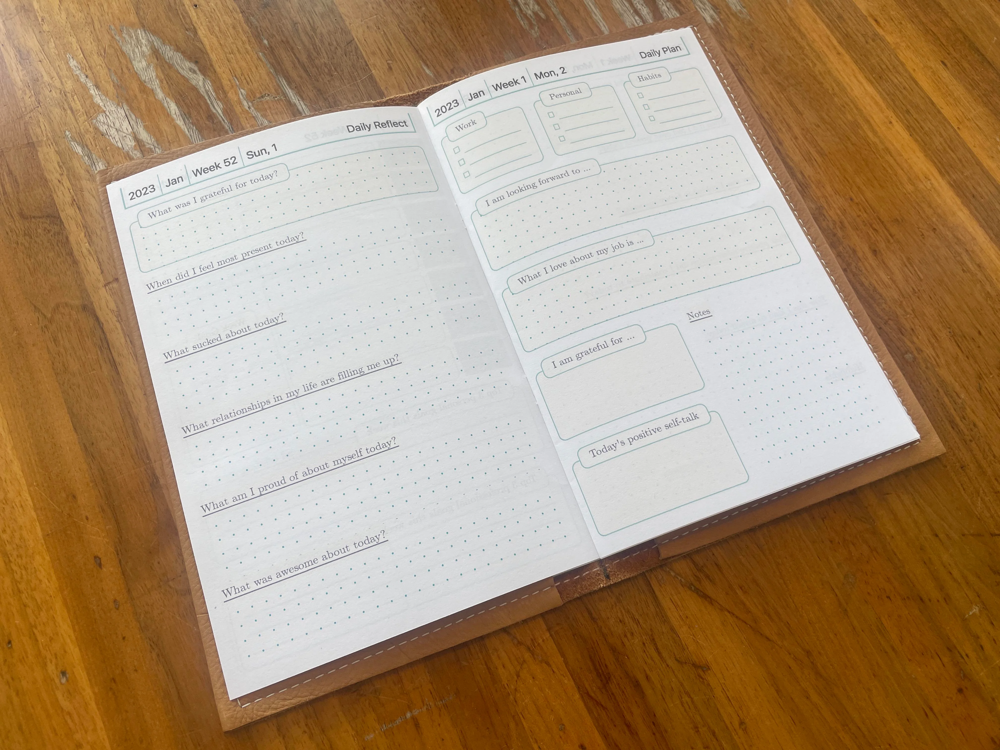

# Join the party, the daily journal party

https://dailyjournal.party

This is a tool I built after getting frustrated with how bulky it was to carry around a 90 day planner like https://monkmanual.com/ or a yearly planner like https://dailygreatness.co/. It is inspired by the format and questions in both.


# See it in action




# Local Development

```
yarn install
yarn start
```

server will be running at http://localhost:3000

# Development notes

## Preview all themes

http://localhost:3000/debug/themes

## Regenerate opengraph card

squint screenshot http://localhost:3000/opengraph --selector=.ogcard -o public/ogimage.png; file public/ogimage.png
